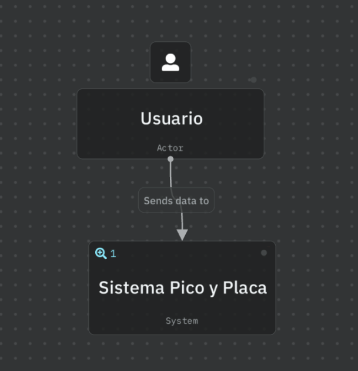
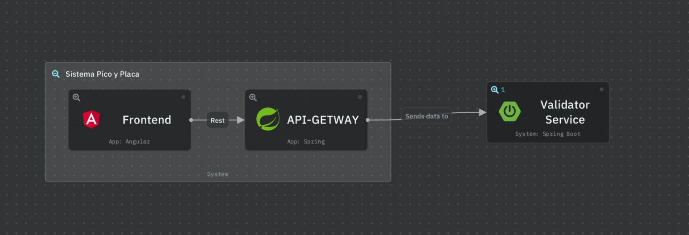
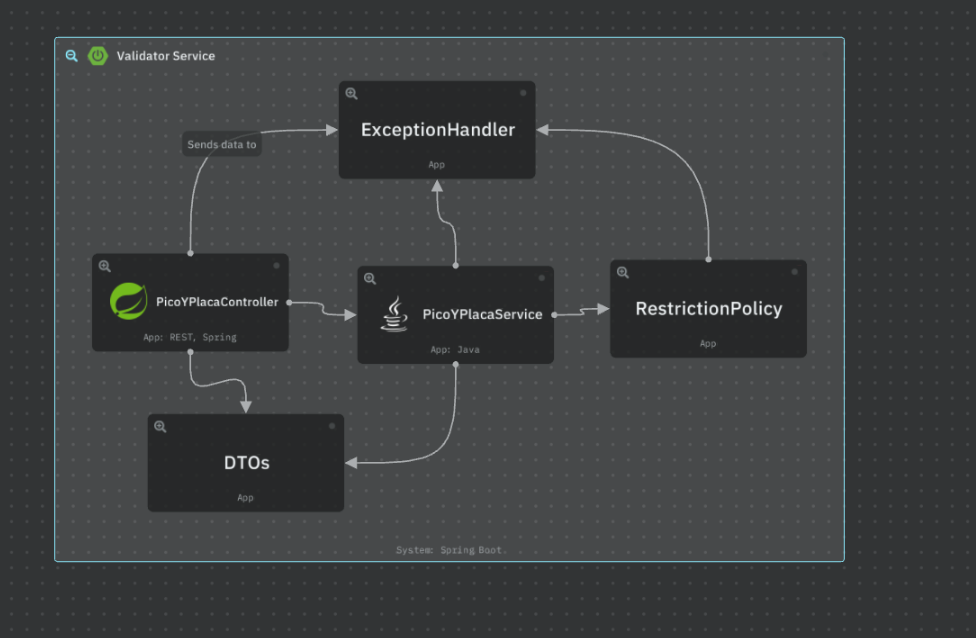

## BACKEND DEL SISTEMA DE VALIDACIÓN DE CEDULA
### Desarrollado en Spring Boot

## Requisitos
- JAVA 21
- Maven 3.5.3
- Git
## Para ejecutar en Windows
```bash
git clone https://github.com/tuusuario/validator-service.git
cd validator-service
./mvnw.cmd spring-boot:run
```

### Para probar la API se puede usar swagger mediante 

http://localhost:8081/swagger-ui/index.html

### Para probar el endpoint se usa 
```bash
{
  
  "placa": "AAA3450",
  "fecha": "2025-07-25",
  "hora": "17:00"
}
```

Estructura del proyecto
controller: expone los endpoints REST

service: lógica de negocio

dto: modelos de entrada/salida

restriction: validación de pico y placa

exception: manejo de errores


# Arquitectura
## Diagrama de Contexto


## Diagrama de Contenedores


## Diagrama de Componentes


También disponible en
https://s.icepanel.io/kbuwQPKgV2hzkr/TMh9

